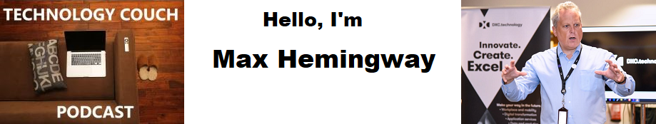

## Work

I am a Chief Technologist at [DXC Technology](https://www.dxc.technology/) with over 30 years experience working in the IT Industry. Working with customers, designing and delivering enterprise level solutions to business requirements to deliver business outcomes. I have extensive knowledge in the design and deployment of applications, systems and network architectures to support cloud and traditional based business services. Experience in the Journey to Digital and the Digital Landscape. I am a Fellow of the British Computer Society, Chartered IT Professional as well as TOGAF 9 Certified. I am also a STEM Ambassador [STEM.org.uk](https://www.stem.org.uk/stem-ambassadors/)

## Channels

I am active across a number of social channels

- [Linked in](https://www.linkedin.com/in/maxhemingway/)
- [Twitter](https://twitter.com/Max_Hemingway)

### Blog

I have a [Blog](https://maxhemingway.com/) where I write about various topics.

### Podcast

My Podcast is available via the following channels

- [Technology Couch Podcast @ Apple Podcasts](https://podcasts.apple.com/us/podcast/technology-couch-podcast/id1337716543)
- [Technology Couch Podcast @ my Blog](https://maxhemingway.com/tag/technology-couch-podcast/)
